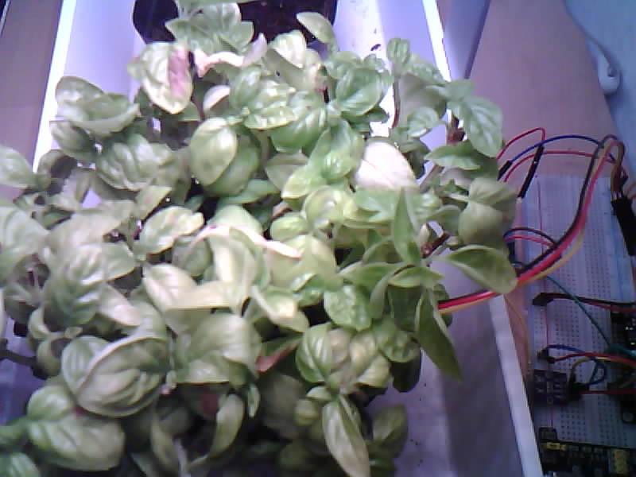

# ESP32-CAM REST API

A simple REST API for the ESP32-CAM (OV2640) running on MicroPython



## Features

- Capture images via HTTP endpoint
- Get camera status
- Basic health check endpoint

## API Endpoints

- `GET /` - Health check
- `GET /capture` - Take a photo and return it as JPEG
- `GET /status` - Get current camera status

## Prerequisites

1. Install the dev requirements `pixi install`
2. Flash the ESP32-CAM firmware:
   - Download the camera-enabled MicroPython firmware from [esp32-cam-micropython-2022](https://github.com/shariltumin/esp32-cam-micropython-2022)
   - I am using firmwares-20230717/ESP32/AI-Thinker-OV2640/WiFi-SSL
   - Flash it using esptool.py

## Setup
1. Copy the .env.example file to .env `cp .env.example .env`
2. Update the WiFi credentials in `.env`
3. Run the install script `pixi run install` (while the ESP32-CAM is connected)

## Usage

After setting up, the API will be available at `http://esp32cam.local`

Example using curl:
```bash
# Get health status
curl http://esp32cam.local/

# Capture image
curl http://esp32cam.local/capture > image.jpg

# Get camera status
curl http://esp32cam.local/status
```

## Credits and Acknowledgments

This project builds upon the work of several open source projects and resources:

- [MicroPython](https://micropython.org/) - The core Python implementation for microcontrollers
- [esp32-cam-micropython-2022](https://github.com/shariltumin/esp32-cam-micropython-2022) - ESP32-CAM driver and firmware
- [microdot](https://github.com/miguelgrinberg/microdot) - Modern and lightweight web framework for MicroPython
